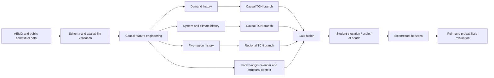

# Queensland Electricity Demand Forecasting

**Leakage-aware, multi-horizon probabilistic forecasting for Queensland's five-minute electricity market**


This repository is the public portfolio edition of an end-to-end
machine-learning project for forecasting Queensland operational electricity
demand. It demonstrates how I turned public energy-market, weather, calendar,
population, and distributed-energy data into a chronologically evaluated
forecasting system, progressing from transparent baselines to deterministic
and probabilistic Temporal Convolutional Networks (TCNs).

The public study covers **2015–2020**. Development and model selection are
restricted to **2015–2019**. Because 2020 had been encountered during the
broader historical project, it is reported here as a **held-out chronological
RR benchmark reconstructed under a frozen protocol**, not as a previously
unseen test set. The original public model lineage culminates in
`TCN_starNLL`; the final post-project extension, `TCN_starNLL_noSD`, adds
causal terminal estimates for demand and direct radiation without estimate-SD
channels.

> **Evidence status:** historical maintainer verification found exact parity
> for all 96 compared frozen-frame columns over 629,273 eligible origins; the
> undistributed comparison cache is not available to a clean clone. The
> sanitized [parity manifest](outputs/03_feature_contract/public_parity_manifest.json)
> records that result. The final `TCN_starNLL_noSD` members at seeds 42, 142,
> and 242, their equal-weight Student-t mixture ensemble, and the frozen 2020
> comparison with AEMO are complete. The checked ONNX artifact documents the
> original `TCN_starNLL` architecture. Later-year private-research results are
> not used here.

## At a glance

| Item | Public RR contract |
|---|---|
| Forecast target | Queensland operational demand change, reconstructed to demand in MW |
| Cadence | Five minutes |
| Horizons | 5, 10, 15, 20, 25, and 30 minutes |
| Development data | 2015–2019 only |
| Final evaluation | Held-out chronological 2020 RR benchmark under a frozen protocol |
| Principal architecture | Multi-branch causal TCN with late context fusion |
| Probabilistic output | Student-t location, scale, and degrees of freedom per horizon |
| Main point metrics | MAE, RMSE, and signed bias in MW |
| Distribution metrics | Negative log likelihood and calibration diagnostics |
| External reference | AEMO five-minute demand forecast, aligned and scored separately |
| Reproducibility | Pinned environment, exact Windows lock, deterministic contracts, tests, manifests, and checksums |

## Why this problem matters

Queensland demand moves at several interacting time scales. Recent load
momentum matters over minutes; weather and rooftop solar alter regional demand
shapes; calendar effects change the relationship between time and consumption;
and slow structural variables change the long-run level of the system. A useful
forecast therefore has to preserve short-term chronology without allowing
future information, revised records, or test-period statistics to leak into
training.

The project addresses two related questions:

1. How accurately can demand be forecast along the complete next-30-minute
   path rather than at only one endpoint?
2. Can the model express useful forecast uncertainty during volatile and
   heavy-tailed demand changes?

At forecast origin \(t\), the deterministic target at horizon \(h\) is the
demand change

\[
\Delta D_{t,h}=D_{t+h}-D_t,
\]

and the demand-level forecast is reconstructed as

\[
\widehat D_{t+h}=D_t+\widehat{\Delta D}_{t,h},
\qquad h\in\{5,10,15,20,25,30\}\text{ minutes}.
\]

Predicting change avoids presenting persistence in the demand level as if it
were modelling skill. Reporting in MW keeps the final error measures directly
interpretable.

## Results

### Headline result — probabilistic six-horizon forecasting with 22.44% lower 30-minute MAE than AEMO P5MIN

The final held-out comparison contains only the model selected from 2019
development evidence and the published AEMO P5MIN external benchmark. Both are
scored at the equivalent 30-minute horizon on the exact 105,400 forecast
origins common to them in the 2020 study period.

| Rank | Model | Role | Forecast origins | 30-minute MAE (MW) | 30-minute RMSE (MW) | Bias (MW) | MAE gain vs AEMO |
|---:|---|---|---:|---:|---:|---:|---:|
| 1 | `TCN_starNLL_noSD` three-seed ensemble | 2019-selected champion | 105,400 | **47.355** | **64.308** | 2.672 | **22.44%** |
| 2 | AEMO P5MIN external benchmark | Published external benchmark | 105,400 | 61.056 | 81.256 | -1.095 | Baseline |

The model produces more than a point forecast. At each of the 5, 10, 15, 20,
25, and 30-minute horizons, every ensemble member predicts a Student-t
location, scale, and degrees of freedom. The three member densities are
combined as an equal-weight mixture. This provides a complete predictive
distribution from which the system can derive central forecasts, prediction
intervals, tail-risk measures, and probabilities of operational thresholds.

For example, suppose current demand is 7,000 MW and an illustrative 30-minute
head has a change location of +120 MW, scale of 60 MW, and 5 degrees of
freedom. The point forecast is 7,120 MW, while the same head estimates the
probability of demand exceeding 7,200 MW as
`P(change > 200 MW)`, approximately **12%** under that Student-t distribution.
The values in this example are illustrative; they are not a selected row from
the evaluation data.

For the directly comparable point-forecast benchmark, the extension ensemble
reduces 30-minute MAE by **13.701 MW** over the
equivalent published AEMO P5MIN forecast. The percentage gain is calculated as
`(AEMO MAE - model MAE) / AEMO MAE × 100` on the common study-period origins.
`TCN_starNLL_noSD` was selected using 2019 validation only; its three members
were then refitted on 2015–2019 for exactly 10 epochs and frozen before this
2020 evaluation. Other development candidates are not ranked on the final
period. The complete final protocol and retained comparison are in
[`notebooks/10_final_2020_evaluation.ipynb`](notebooks/10_final_2020_evaluation.ipynb).

### Post-project extension: 2019 validation

The final no-SD causal-estimate extension
(`TCN_starNLL_causal_feature_estimates_no_sd`, shortened here to
`TCN_starNLL_noSD`) was trained on 2015–2018 and validated on 2019. Its final
result is an equal-weight mixture of the seed 42, 142, and 242 Student-t
members. Each member contributes its minimum-2019-validation-NLL checkpoint;
ensemble weights were not fitted.

These development results are reported separately from the frozen 2020 result
above. They establish `TCN_starNLL_noSD` as the extension champion before any
2020 scoring. The 2019 comparison is not perfectly symmetric: the no-SD
candidate has a three-seed ensemble, while the SD-inclusive and
direct-radiation comparators remain single-seed evidence.

| Candidate rank by MAE | Model | Evidence scope | Validation NLL (standardized) | MAE (MW) | RMSE (MW) |
|---:|---|---|---:|---:|---:|
| 1 | `TCN_starNLL_noSD` | Three-seed Student-t ensemble | **0.718355** | **37.583** | **49.329** |
| Supporting member | `TCN_starNLL_noSD`, seed 42 | Single minimum-NLL checkpoint | 0.734999 | 38.091 | 49.973 |
| 2 | `TCN_starNLL_causal_feature_estimates`, seed 42 | Single minimum-NLL checkpoint | 0.736293 | 38.203 | 50.165 |
| 3 | `TCN_starNLL_direct_radiation`, seed 42 | Single minimum-NLL checkpoint | 0.737551 | 38.287 | 50.301 |
| External benchmark | AEMO P5MIN | Aligned 2019 point forecasts | — | 47.119 | 61.315 |

The retained evidence, member epochs, and full interpretation boundary are in
[`notebooks/11_extension_modelling.ipynb`](notebooks/11_extension_modelling.ipynb)
and the corresponding
[`2019 comparison table`](outputs/11_extension_modelling/model_comparison_2019_with_no_sd_ensemble.csv).

## Model evolution

The public repository tells the modelling story rather than exposing only the
last network:

| Stage | Purpose | What it establishes |
|---|---|---|
| Persistence and weekly seasonal naive | Transparent minimum baselines | Whether a learned model beats simple temporal carry-forward rules |
| Comparable-history empirical model | Non-parametric change reference | Whether similar historical conditions contain useful local signal |
| Ridge regression | Regularised linear benchmark | Value of the engineered information set without a deep network |
| Gaussian, Student-t and empirical-residual linear references | Probabilistic endpoint benchmarks | Whether residual uncertainty is better represented by Gaussian, heavy-tailed or empirical distributions |
| `TCN1`–`TCN3` | Controlled architecture development | Value of causal convolutions, branch structure, and temporal depth |
| `TCN_star` | Long-context deterministic model | Value of a 42-hour input history and repeated dilation cycle |
| `TCN_starNLL` | Probabilistic extension | Dynamic location, scale, and tail thickness at all six horizons |
| `TCN_starNLL_noSD` | Final causal-estimate extension | Terminal demand and direct-radiation estimates without estimate-SD channels |
| Three-seed ensemble | Replication and variance reduction | Reduces sensitivity to a single random initialization |

Each retained comparison must use an explicitly recorded feature contract,
chronological split, seed, training configuration, checkpoint rule, and scoring
implementation. The 2020 gate is not used to select among these stages.

## Architecture

The checked artifact is documented in the
[`TCN_starNLL` model card](docs/model_card_tcn_star_nll.md). Its static
[architecture rendering](outputs/model_artifacts/TCN_starNLL_architecture.png)
can be reviewed directly, while the
[opset-18 ONNX file](outputs/model_artifacts/TCN_starNLL_2020_seed_42.onnx)
can be opened in Netron.



The verified `TCN_star` lineage uses:

- **505 five-minute states**, covering the forecast origin and preceding 42
  hours;
- kernel size **5**;
- twelve residual blocks with dilations
  `1, 2, 4, 8, 16, 32` repeated twice;
- a theoretical causal receptive field of **1,009 five-minute steps**;
- separate demand, system/climate, and regional temporal branches;
- static forecast-origin context joined only at late fusion; and
- six simultaneous output horizons.

`TCN_starNLL` retains that backbone and predicts three values for every
horizon:

- `mu`: location and point forecast in standardized target space;
- `scale`: strictly positive predictive scale; and
- `df`: degrees of freedom bounded above 2, preventing undefined variance and
  limiting uncontrolled tail behaviour.

Training minimizes Student-t negative log likelihood. Point forecasts use the
location output and are transformed back to MW for evaluation.

The checked export accepts 7 demand, 16 system, 2 climate, and 5 × 10 regional
temporal channels, each with 505 states, plus 55 encoded calendar values and
one statewide-population scalar. Later post-2020 research features are not
carried into this public model.

## Information set

The candidate public-era inputs are grouped by how and when they are available:

| Context | Examples | Model route |
|---|---|---|
| Demand history | Current demand and causal short/daily/weekly lags | Demand TCN branch |
| System history | Available generation, net interchange, UIGF, supply cushion, and causal lags | System/context TCN branch |
| Climate history | Lagged broad-scale climate indicators, only where publication timing is defensible | Context branch or late fusion according to the verified contract |
| Regional history | Temperature, humidity/thermal, cloud/rainfall, solar-capacity, and daylight timing variables | Regional temporal branch |
| Calendar | Day/week/year cycles, weekend, public- and school-holiday context | Forecast-origin late fusion |
| Structural | Original annual Queensland population estimate | Forecast-origin late fusion |

Weather and regional structural data are organised around five representative
Queensland nodes:

1. Brisbane;
2. Cairns / Atherton;
3. Dalby / Chinchilla;
4. Emerald / Gladstone; and
5. Townsville / Burdekin.

The public feature table documents, for every field, its provider,
formula, timestamp meaning, publication assumption, raw range, transformation,
fitted statistics, tensor context, and missing-value rule. Features are not
admitted merely because they exist in one of the research repositories.

## Data sources and provenance

| Provider | Public product | Project role | Redistribution policy |
|---|---|---|---|
| Australian Energy Market Operator (AEMO) | NEM `DISPATCHREGIONSUM` | Queensland demand, generation, interchange, UIGF, record metadata, and operational benchmark fields | Source and processed datasets are rebuilt locally, not committed |
| Open-Meteo | Historical Weather API | Hourly gridded weather for the five project nodes | No complete dataset committed; request metadata and attribution required |
| Australian Bureau of Statistics | ASGS 2016 POA boundaries | Auditable postcode-to-region allocation for distributed solar capacity | Frozen source archive remains local |
| Clean Energy Regulator | SRES postcode capacity data | Regional distributed-energy capacity | Source files remain local; derived use requires attribution |
| State of Queensland | Public-holiday and school-calendar information | Known-ahead calendar context | Original generation code is published; source terms remain applicable |
| Queensland Government Statistician's Office | Historical annual Queensland population estimates | Statewide structural late-fusion context | Bounded source extract and provenance are retained |

The repository contains acquisition and transformation code, sanitized
manifests, schema contracts, checksums, and deliberately small derived or
synthetic fixtures—not an unreviewed copy of third-party research data. See
[`THIRD_PARTY_DATA.md`](THIRD_PARTY_DATA.md) for attribution and rights
boundaries.

### AEMO record handling

AEMO rows retain the complete record key during ingestion. Multiple record
versions are resolved using `LASTCHANGED`, and intervention solutions are
handled before reducing the data to one physical series per timestamp. Units,
continuity, duplicates, and coverage are checked before features are built.

`DEMANDFORECAST` is deliberately **excluded from model inputs**. AEMO defines
it as a five-minute forecast adjustment rather than a standalone demand-level
forecast. The external five-minute reference is therefore reconstructed from
the previous five-minute `TOTALDEMAND` and the applicable forecast adjustment,
then aligned and scored independently. This avoids both target ambiguity and
information redundancy from feeding another forecaster's output into the
research model.

### Temporal availability

- Every lag and rolling statistic is backward-looking.
- Scalers, imputers, vocabularies, thresholds, and other fitted transforms use
  training-fold rows only.
- Targets near a fold boundary are excluded unless the complete future horizon
  remains inside that same partition.
- Slow-moving data use explicit effective dates and backward as-of joins.
- Hourly weather may be forward-filled only after its source timestamp; future
  observations are never back-filled into earlier five-minute rows.
- Unknown categorical levels receive an explicit fallback category rather than
  changing the encoded width at evaluation time.
- Raw and derived tables are checked for unique, sorted, continuous timestamps.

## Experimental design

Random row-level splitting is unsuitable because nearby electricity records
are strongly dependent. The RR uses chronological development, expanding
training windows where appropriate, and one final hold-out year.

| Component | Public RR rule |
|---|---|
| Study period | 2015–2020, plus only the pre-period history required for causal lags |
| Development | 2015–2019 |
| Final gate | 1 January–31 December 2020 |
| Model selection | Validation data inside the development period only |
| Transform fitting | Training partition only |
| Development checkpoint selection | Minimum validation objective within each development fold |
| Final refit state | Fixed epoch determined from the median development best epoch, frozen before 2020 scoring |
| Replication | Seeds 42, 142, and 242 where the final experiment contract requires three seeds |
| Ensemble | Equal-weight prediction-level combination of the three frozen final member states |
| Final reporting | Aggregate plus horizon-level point and probabilistic metrics |

The 2020 result is retained as a fixed chronological benchmark reconstructed
under a frozen protocol. Its outcomes are not used to modify the RR
reconstruction.

## What this repository demonstrates

- Translating an operational energy question into a testable forecasting
  contract.
- Building multi-source data pipelines with explicit provenance and licensing.
- Resolving versioned AEMO records and aligning mixed-frequency inputs.
- Engineering causal temporal, calendar, energy-system, and regional-weather
  features.
- Designing multi-branch, long-receptive-field causal TCNs.
- Extending deterministic forecasts to heteroscedastic, heavy-tailed predictive
  distributions.
- Preventing leakage through fold-contained preprocessing and boundary tests.
- Managing exact experiment identity across configurations, seeds,
  checkpoints, predictions, metrics, and ensembles.
- Exporting and validating portable ONNX architecture artifacts.
- Communicating technical results with explicit limitations rather than
  overstating incomplete evidence.

## Reproducibility

### Reference platform

- Windows 11, x86-64
- Python 3.11.15
- CUDA-enabled Windows build of PyTorch 2.13.0 (`torch-2.13.0+cu130`)
- ONNX opset 18

The readable environment is defined in [`environment.yml`](environment.yml).
The exact reconstruction-tested Windows solution and artifact hashes are in
[`conda-lock.yml`](conda-lock.yml).

### Create and verify the environment

```powershell
git clone https://github.com/cruss19/qld-energy-rr.git
cd qld-energy-rr
conda env create -f environment.yml
conda activate qld-energy-rr
python tools\verify_environment.py --expected-environment-name qld-energy-rr
python -m pytest -m "not source_data" -q
```

The verification utility checks package identity and imports, a Pandas/PyArrow
Parquet round trip, a scikit-learn transformation, a PyTorch forward/backward
pass, ONNX export and structural checking, TensorBoard event creation,
headless plotting, and YAML parsing. The lockfile was also reconstructed in a
disposable environment before acceptance. The command above is the
clean-clone-compatible suite. After the declared provider data have been
acquired and registered locally, run `python -m pytest -q` for the complete
suite, including source-data provenance checks.

Other operating systems are not currently claimed as supported. No hosted-CI
claim is made; the exact Windows environment is defined by the committed lock.

### Reproducibility boundaries

- **Reconstructable:** acquisition, validation, feature construction, public
  contracts, model source, and clean-clone unit/contract tests.
- **Retained historical evidence:** small result tables, parity and run-identity
  manifests, figures, and checked publication artifacts from completed runs.
- **Not distributed:** raw provider archives, large checkpoints, row-level
  predictions, and the frozen historical comparison cache.

The command boundary and retained maintainer-only utilities are listed in
[`docs/maintainer_utilities.md`](docs/maintainer_utilities.md).

Project-authored Matplotlib figures use the shared 10-colour `plasma` cycle in
[`src/rr_plot_style.py`](src/rr_plot_style.py). Pairplot feature names are
rotated diagonally for legibility, together with their x-axis tick labels.

## Repository map

| Location | Purpose |
|---|---|
| `config/` | Public experiment definitions and immutable contracts |
| `data/` | Manifests, schemas, local rebuild targets, and synthetic fixtures |
| `docs/` | Architecture, provenance, methodology, model cards, and evaluation notes |
| `notebooks/` | Curated analyses that support the published narrative |
| `outputs/` | Reproducible public figures, tables, and model artifacts |
| `src/` | Reusable acquisition, feature, model, and evaluation code |
| `tests/` | Unit, contract, leakage, and reproducibility tests |
| `tools/` | Command-line build, verification, training, and evaluation utilities |
| `tensorboard/` | TensorBoard launch and comparison helpers |
| `tensor_logs/` | Local event streams; ignored by Git unless deliberately curated |
| `training_output/` | Local checkpoints and run artifacts; ignored by Git by default |

### Notebook sequence

1. `01_data_acquisition_and_provenance.ipynb`
2. `02_data_validation_and_preparation.ipynb`
3. `03_feature_development_and_reference_contracts.ipynb`
4. `04_development_data_quality_and_eda.ipynb`
5. `05_reference_models.ipynb`, with `05b_probabilistic_reference_models.ipynb`
   as its probabilistic companion
6. `06a_tcn1_development.ipynb`, `06b_tcn2_development.ipynb`, and
   `06c_tcn3_development.ipynb` introduce the three compact TCN prototypes;
   `06d_tcn_prototype_comparison.ipynb` compares their development folds
7. `07_tcn_star_development.ipynb`
8. `08_tcn_star_nll_development.ipynb`
9. `09_tcn_ensemble_comparison.ipynb`
10. `10_final_2020_evaluation.ipynb`
11. `11_extension_modelling.ipynb` is an explicitly post-project extension

The source comparison and reconstruction decisions are recorded in [`docs/notebook_reconstruction_provenance.md`](docs/notebook_reconstruction_provenance.md).

Superseded comparison notebooks are retained under
[`notebooks/archive/`](notebooks/archive/README.md) only as reconstruction
history and are not part of the public reader journey.

## Public evidence trail

The retained release evidence includes:

1. source, attribution, and licensing documentation;
2. sanitized source manifests with retrieval metadata and checksums;
3. deterministic acquisition and preprocessing commands;
4. feature schemas, value ranges, transformations, and leakage tests;
5. exact baseline and TCN experiment configurations;
6. model cards and a static architecture diagram;
7. a checked ONNX model that can be inspected with
   [Netron](https://netron.app/);
8. the sanitized
   [final TCN member identity manifest](outputs/model_artifacts/final_tcn_member_identities.csv),
   containing final seed and fixed-state identities without checkpoints or
   row-level predictions;
9. retained aggregate and horizon-level result tables;
10. forecast-versus-observed and calibration figures; and
11. a carefully qualified AEMO comparison.

GitHub does not natively turn an ONNX file into an architecture diagram. The
README therefore links a static, reviewable rendering, the detailed model card,
and the checked `.onnx` artifact for interactive inspection in Netron.

## Public/private boundary

This repository covers the reproducible **2015–2020 development phase through
the `TCN_starNLL` model family**. It is intentionally not a mirror of the full
research workspace.

Excluded from this public repository are:

- material outside the declared 2015–2020 public research boundary;
- unrelated historical research branches and internal workspace material;
- deployment and commercial product engineering;
- machine-specific paths, credentials, caches, and raw provider archives; and
- artifacts whose provenance, licensing, or experiment identity is not yet
  sufficiently defensible.

Nothing enters the RR merely because it already exists. It enters only because
it serves the RR's public purpose and passes relevance, provenance, licensing,
privacy, and reproducibility review.

## Limitations

- Historical performance does not establish future performance under changing
  market, technology, climate, or demand regimes.
- The five regional nodes approximate statewide spatial conditions.
- Historical weather is gridded reanalysis/model data rather than direct
  observation at every named location.
- Exact operational publication latency must be documented for any feature
  presented as forecast-origin available.
- AEMO comparisons are sensitive to forecast origin, target timestamp,
  intervention handling, revisions, aggregation, and metric definition.
- Third-party data remain subject to provider terms and are not automatically
  redistributable because they are publicly accessible.
- The original statistical, probabilistic linear, and earlier TCN models are
  development evidence. They are not ranked on the final 2020 period.

## Project status

| Area | Status |
|---|---|
| Repository scaffold | Complete |
| Windows environment and exact lock | Complete and reconstruction-tested |
| Environment verification tool | Complete |
| Public data contracts and source manifests | Complete for the published 2015–2020 workflow |
| Curated source-code migration | Complete for the published model lineage |
| Public feature contract | Current YAML expanded to 91 declared feature rows; historical exact parity verified for all 96 compared frozen-frame columns and recorded in a sanitized manifest |
| Development references | Original statistical, probabilistic linear, and earlier TCN evidence retained outside the final-test ranking |
| 2020 `TCN_starNLL_noSD` three-seed ensemble | Complete; selected on 2019 and frozen before final evaluation |
| ONNX model and architecture rendering | Complete; opset-18 full checker passed |
| Final results and AEMO comparison | Champion-only 30-minute common-origin comparison complete |

## Author and contact

Developed by **cruss19** as an independent applied machine-learning and energy
forecasting project.
